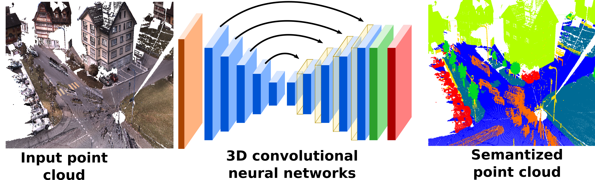

# ConvPoint: Generalizing discrete convolutions for unstructured point clouds





## Updates

**Major performance update**: by reformulating the convolutional layer using matrix mulitplications, the memory consumption has been highly reduced.

## Introduction

This repository propose python scripts for point cloud classification and segmentation. The library is coded with PyTorch.

A preprint of the paper can be found on Arxiv:  
http://arxiv.org/abs/1904.02375


## License

Code is released under dual license depending on applications, research or commercial. Reseach license is GPLv3.
See the [license](LICENSE.md).

## Citation

If you use this code in your research, please consider citing:
(citation will be updated as soon as 3DOR proceedings will be released)

```
@inproceedings{boulch2019,
  title={Generalizing discrete convolutions for unstructured point clouds},
  author={Boulch, Alexandre},
  booktitle={Eurographics Workshop on 3D Object Retrieval},
  year={2019}
}
```

## Dependencies

- Pytorch
- Scikit-learn for confusion matrix computation, and efficient neighbors search  
- TQDM for progress bars
- PlyFile
- H5py

All these dependencies can be install via conda in an Anaconda environment or via pip.

## The library

## Usage

We propose scripts for training on several point cloud datasets:
- ModelNet40 (meshes can be found here [https://shapenet.cs.stanford.edu/media/modelnet40_ply_hdf5_2048.zip](https://shapenet.cs.stanford.edu/media/modelnet40_ply_hdf5_2048.zip)). The meshes are sampled in the code using Trimesh.
- ShapeNet *(code to be added)*
- S3DIS *(code to be added)*
- Semantic8 *(code to added)*

### ModelNet40

#### Training
```
python modelnet_classif.py --rootdir path_to_modelnet40_data
```

#### Testing

For testing with one tree per shape:
```
python modelnet_classif.py --rootdir path_to_modelnet40_data --savedir path_to_statedict_directory --test
```
For testing with more than one tree per shape: *(this code is not optimized at all and is very slow)*
```
python modelnet_classif.py --rootdir path_to_modelnet40_data --savedir path_to_statedict_directory --test --ntree 2
```

### ShapeNet

#### Data preparation

The script for downloading and preparing the point clouds are from *PointCNN* repository https://github.com/yangyanli/PointCNN[](https://github.com/yangyanli/PointCNN).
They are in the ```data_conversions``` folder.

```
python3 ./download_datasets.py -d shapenet_partseg -f path_to_directory
python3 ./prepare_partseg_data.py -f path_to_shapenet_partseg
```

#### Training

The training script is ```shapenet_seg.py```:

```
python shapenet_seg.py --savedir path_to_save_directory --rootdir path_to_shapenet_partseg
```

#### Testing

- **Inference**

Testing is a two-step process. First, inference with ```shapenet_seg.py``` script:

```
python shapenet_seg.py --savedir path_to_model_directory  --rootdir path_to_shapenet_partseg --test
```
You can also use the ```--ply``` flag to generate PLY file for result visualization.

The previous command line is result with one spatial tree. To test with multiple spatial trees, use the  ```--ntree``` flag:

```
python shapenet_seg.py --savedir path_to_model_directory  --rootdir path_to_shapenet_partseg --test --ntree 4
```

- **Scores**

The scores computation scripts are also adapted from *PointCNN* repository https://github.com/yangyanli/PointCNN[](https://github.com/yangyanli/PointCNN).

```
python shapenet_seg_eval.py --rootdir path_to_shapenet_partseg --preddir path_to_predictions
```

You can also compute the part average scores using the flag ```--part_av```.

### S3DIS

**Code to be released**

### Semantic8

**Code to be released**